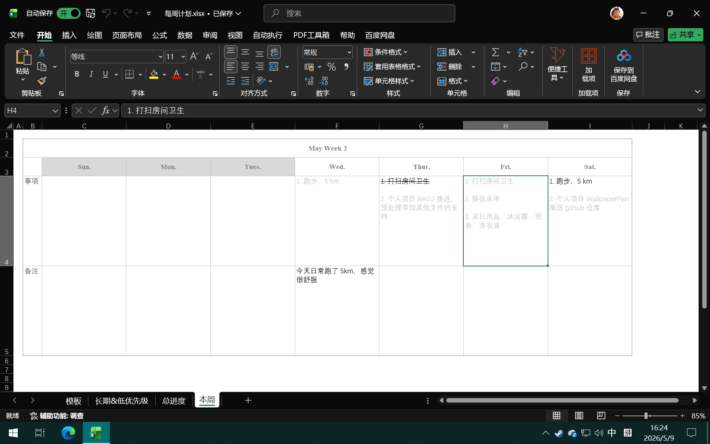
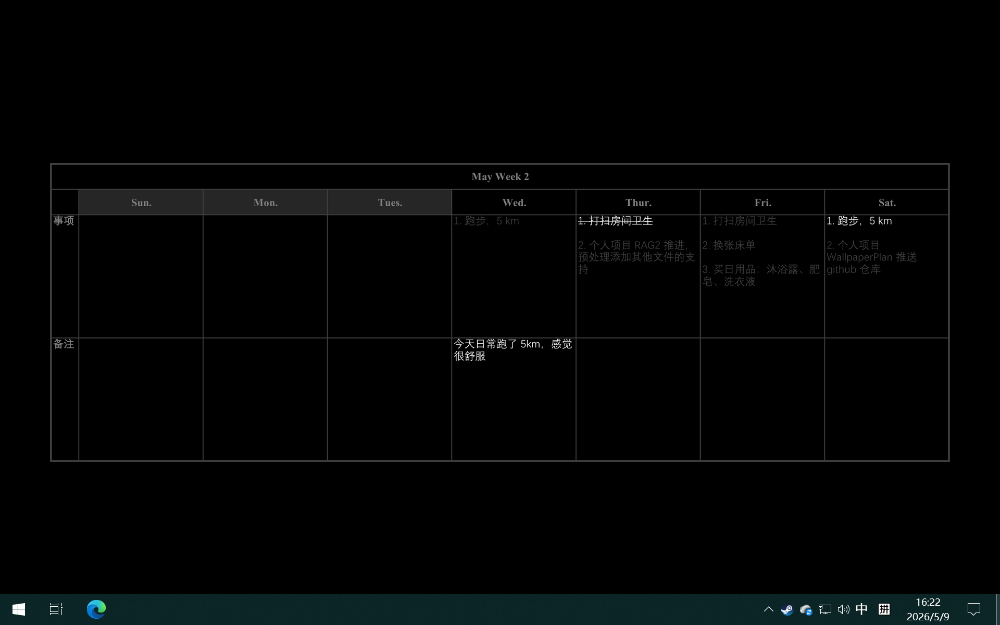

# WallpaperPlan

将 Excel 表格转换为桌面壁纸的小工具。

## 功能特性

- 将 Excel 工作表导出为 PDF 并转换为 PNG 图片
- 自动裁剪白边，保留表格内容
- 支持颜色反转（白色背景转为黑色背景，白色文字）
- 图片自动缩放并居中放置在黑色桌面上
- 程序运行日志记录
- 配置通过 YAML 文件管理，无需修改代码

## 目录结构

```
WallpaperPlan/
├── WallpaperPlan.exe    # 可执行文件
├── config/
│   └── config.yaml      # 配置文件
├── logs/                # 日志目录（程序运行后自动生成）
└── temp/                # 临时文件目录（程序运行后自动生成）
```

## 配置说明

编辑 `config/config.yaml` 文件进行配置：

```yaml
# ====================== Excel 文件配置 ======================
# file: Excel 文件的绝对路径；
# sheet: 需要读取的 sheet 页面的名称；
excel:
  file: "D:\_Files\_report\工作计划.xlsx"
  sheet: "本周"

# ======================= 输出目录配置 =======================
# dir: 程序读取、导出、裁剪壁纸的临时目录。需要配置相对路径；
output:
  dir: "temp"

# ======================= 图像处理配置 =======================
# table_scale: 表格于壁纸中的缩放比例，可选 0.1 ~ 1.0 的缩放倍率；
# invert_colors: 是否反转图像颜色，可选 true, false；
# crop_threshold: 图像裁剪阈值。可选 0 ~ 255 的值，且值越低，裁剪越激进。在表格背景颜色为默认的白色的情况下，建议设置为 240 或更高的值；
# dpi: 表格转 PNG 图像的 DPI 设置，可选 72 ~ 600，值越大越清晰；
image:
  table_scale: 0.9
  invert_colors: true
  crop_threshold: 240
  dpi: 200

# ======================= 程序日志配置 =======================
# file_enable: 日志是否写入文件，可选 true, false；
# level: 日志级别，可选 DEBUG, INFO, WARNING, ERROR, CRITICAL；
logging:
  file_enabled: true
  level: "INFO"
```

## 使用方法

### 部署

1. 将 `WallpaperPlan.exe` 和 `config` 文件夹拷贝到同一目录
2. 编辑 `config/config.yaml`，设置 Excel 文件路径和工作表名称

### 运行

双击 `WallpaperPlan.exe` 即可运行。程序会自动：
- 读取配置的 Excel 文件
- 将指定工作表导出为 PDF
- 转换为 PNG 图片并处理
- 设置为桌面壁纸
- 清理临时文件
- 记录运行日志（如果启用）

> 注意，由于表格导出 PDF 实际上使用的是 Windows COM 对象来在后台操控 Excel 程序，而 Excel 程序无法同时打开两个名称一模一样的文件，**因此在运行本程序前，请保存并关闭当前的 Excel 表格。**

## Excel 表格制作指南

由于工具使用 opencv 库，对 PNG 图片进行裁剪。为确保壁纸设置的美观性，建议参照下述建议创建你的表格：

### 1. 表格设计

- 表格必须拥有明确的深色的边界，程序依赖于表格最外圈的边界来对 PNG 图片进行裁剪
- 可以设置合适的行高列宽，确保文字清晰可读

### 2. 打印检查

1. 点击「文件」→「打印」
2. 选择「调整为 1 页宽 1 页高」（使表格在一页内显示）
3. 确保「打印区域」设置正确

### 3. 预览确认

在打印设置界面预览，确保：
- 表格内容完整显示
- 没有多余的空白区域
- 文字清晰可读

### 案例展示

在 1920 × 1200 分辨率的显示器下，`config.yaml` 设置如下参数:

```yaml
# 其余参数自行配置...

# ======================= 图像处理配置 =======================
# table_scale: 表格于壁纸中的缩放比例，可选 0.1 ~ 1.0 的缩放倍率；
# invert_colors: 是否反转图像颜色，可选 true, false；
# crop_threshold: 图像裁剪阈值。可选 0 ~ 255 的值，且值越低，裁剪越激进。在表格背景颜色为默认的白色的情况下，建议设置为 240 或更高的值；
# dpi: 表格转 PNG 图像的 DPI 设置，可选 72 ~ 600，值越大越清晰；
image:
  table_scale: 0.9
  invert_colors: true
  crop_threshold: 240
  dpi: 200

# 其余参数自行配置...
```

表格样式设计如下图所示：



壁纸的展示样式如下：



### 注意事项

- 程序会自动裁剪白边，但如果表格周围有过多的空白，可能影响裁剪效果
- 建议提前在 Excel 中预览打印效果
- 如果表格内容较多，可以适当调整字体大小以确保一屏显示

## 日志

程序运行后会生成日志文件 `logs/wallpaper_YYYYMMDD.log`，其中包含程序运行过程中的详细信息，便于排查问题。
